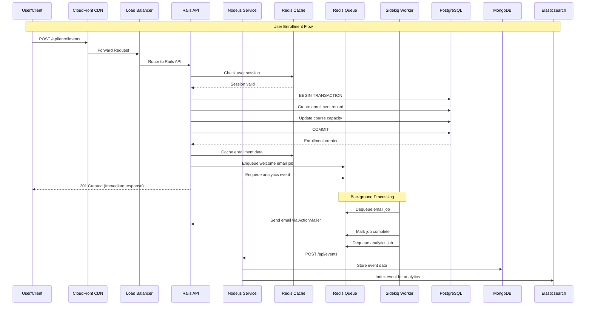
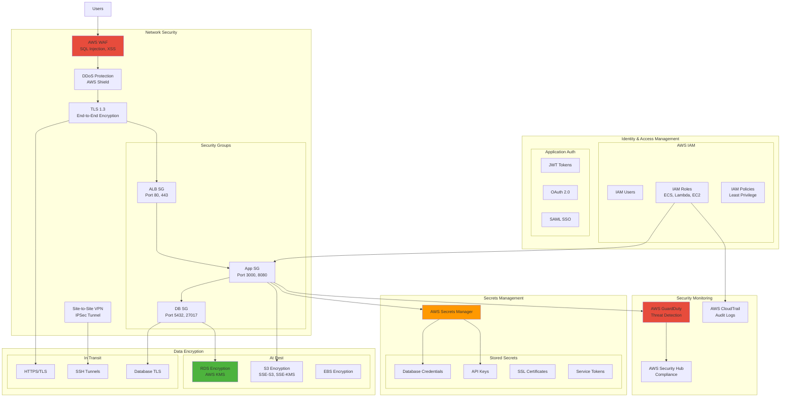

# EduCloud Platform

[](LICENSE)
[](https://www.terraform.io/)
[](https://aws.amazon.com/)
[](https://www.ruby-lang.org/)
[](https://nodejs.org/)

Enterprise-grade Learning Management System (LMS) infrastructure built on multi-cloud architecture, demonstrating production-ready DevOps practices and cloud-native design patterns.

---

## 📋 Table of Contents

- [Overview](#overview)
- [Architecture](#architecture)
- [Technology Stack](#technology-stack)
- [Prerequisites](#prerequisites)
- [Getting Started](#getting-started)
- [Deployment](#deployment)
- [Configuration](#configuration)
- [Monitoring & Observability](#monitoring--observability)
- [Security](#security)
- [Contributing](#contributing)
- [License](#license)

---

## 🎯 Overview

EduCloud Platform is a scalable, cloud-native learning management system designed to support enterprise-level educational content delivery. The platform leverages modern DevOps practices, infrastructure as code, and multi-cloud deployment strategies to ensure high availability, security, and performance.

### Key Features

- **Multi-Cloud Architecture**: Deployed across AWS (EU-WEST-2) and Google Cloud Platform
- **Microservices Design**: Ruby on Rails API and Node.js services with independent scaling
- **High Availability**: Multi-AZ deployment with automated failover
- **Infrastructure as Code**: Complete Terraform/Terragrunt implementation
- **Containerized Workloads**: Docker and Kubernetes orchestration
- **Automated CI/CD**: Jenkins-based deployment pipelines
- **Comprehensive Monitoring**: Prometheus, Grafana, and CloudWatch integration
- **Enterprise Security**: IAM, encryption at rest/transit, VPN connectivity

### Use Cases

- Corporate training and onboarding programs
- Professional certification courses
- Partner and customer education
- Compliance and regulatory training
- Continuous learning platforms

---

## 🏗️ Architecture

### High-Level System Architecture
```mermaid
graph TB
    subgraph "Users & Clients"
        Users[End Users]
        Admin[Administrators]
        API_Clients[API Clients]
    end
    
    subgraph "Edge & CDN Layer"
        CF[CloudFront CDN]
        LE[Lambda@Edge]
        WAF[AWS WAF]
    end
    
    subgraph "Load Balancing Layer"
        ALB[Application Load Balancer]
        NLB[Network Load Balancer]
    end
    
    subgraph "Application Layer - AWS"
        subgraph "ECS Cluster"
            Rails_API[Rails API<br/>Ruby on Rails 7]
            Node_Service[Node.js Service<br/>Express.js]
            Sidekiq[Sidekiq Workers<br/>Background Jobs]
        end
    end
    
    subgraph "Application Layer - GCP"
        subgraph "GKE Cluster"
            Rails_GKE[Rails Pods<br/>Kubernetes]
            Node_GKE[Node Pods<br/>Kubernetes]
        end
    end
    
    subgraph "Data Layer - Databases"
        PG[(PostgreSQL RDS<br/>Primary Database)]
        Mongo[(MongoDB Atlas<br/>Event Store)]
        Redis[(Redis Elasticache<br/>Cache & Sessions)]
        ES[Elasticsearch<br/>Search & Analytics]
    end
    
    subgraph "Storage Layer"
        S3[S3 Buckets<br/>Static Assets]
        GCS[Google Cloud Storage<br/>Backups]
    end
    
    subgraph "CI/CD Layer"
        Jenkins[Jenkins<br/>CI/CD Server]
        GitHub[GitHub<br/>Source Control]
        ECR[Amazon ECR<br/>Container Registry]
        GCR[Google GCR<br/>Container Registry]
    end
    
    subgraph "Monitoring & Logging"
        Prom[Prometheus<br/>Metrics]
        Graf[Grafana<br/>Dashboards]
        CW[CloudWatch<br/>AWS Logs]
        Fluentd[Fluentd<br/>Log Aggregation]
    end
    
    Users --> CF
    API_Clients --> CF
    Admin --> CF
    
    CF --> WAF
    WAF --> LE
    LE --> ALB
    LE --> NLB
    
    ALB --> Rails_API
    ALB --> Node_Service
    NLB --> Rails_GKE
    NLB --> Node_GKE
    
    Rails_API --> PG
    Rails_API --> Redis
    Rails_API --> Mongo
    Rails_API --> S3
    Rails_API --> ES
    
    Node_Service --> Mongo
    Node_Service --> Redis
    Node_Service --> ES
    
    Rails_API --> Sidekiq
    Sidekiq --> Redis
    Sidekiq --> PG
    
    Rails_GKE --> PG
    Node_GKE --> Mongo
    
    GitHub --> Jenkins
    Jenkins --> ECR
    Jenkins --> GCR
    ECR --> Rails_API
    GCR --> Rails_GKE
    
    Rails_API --> Prom
    Node_Service --> Prom
    Rails_API --> CW
    
    Prom --> Graf
    Fluentd --> ES
    
    PG -.->|Backup| GCS
    S3 -.->|Replication| GCS
    
    style CF fill:#ff9900
    style LE fill:#ff9900
    style Rails_API fill:#cc0000
    style Node_Service fill:#68a063
    style PG fill:#336791
    style Mongo fill:#4DB33D
    style Redis fill:#d82c20
    style ES fill:#00bfb3
    style Jenkins fill:#d24939
    style Prom fill:#e6522c
    style Graf fill:#f46800
```

### Network Architecture
```mermaid
graph TB
    subgraph "Internet"
        Users[End Users]
        Internet[Public Internet]
    end
    
    subgraph "AWS VPC - EU-WEST-2 - 10.0.0.0/16"
        subgraph "Availability Zone A"
            subgraph "Public Subnet A - 10.0.1.0/24"
                ALB_A[ALB Instance A]
                NAT_A[NAT Gateway A]
                Bastion_A[Bastion Host A]
            end
            
            subgraph "Private Subnet A - 10.0.10.0/24"
                ECS_A[ECS Tasks A]
                RDS_A[(RDS Primary)]
            end
        end
        
        subgraph "Availability Zone B"
            subgraph "Public Subnet B - 10.0.2.0/24"
                ALB_B[ALB Instance B]
                NAT_B[NAT Gateway B]
                Bastion_B[Bastion Host B]
            end
            
            subgraph "Private Subnet B - 10.0.11.0/24"
                ECS_B[ECS Tasks B]
                RDS_B[(RDS Standby)]
            end
        end
        
        IGW[Internet Gateway]
        VPCE[VPC Endpoints<br/>S3, ECR]
    end
    
    subgraph "Security"
        subgraph "AWS Security Groups"
            SG_ALB[ALB SG<br/>80, 443 from 0.0.0.0/0]
            SG_ECS[ECS SG<br/>3000, 8080 from ALB]
            SG_RDS[RDS SG<br/>5432 from ECS]
        end
    end
    
    Users --> Internet
    Internet --> IGW
    IGW --> ALB_A
    IGW --> ALB_B
    
    ALB_A --> ECS_A
    ALB_B --> ECS_B
    
    ECS_A --> NAT_A
    ECS_B --> NAT_B
    NAT_A --> IGW
    NAT_B --> IGW
    
    ECS_A --> RDS_A
    ECS_B --> RDS_A
    RDS_A -.->|Replication| RDS_B
    
    ECS_A --> VPCE
    ECS_B --> VPCE
    
    Bastion_A --> ECS_A
    Bastion_B --> ECS_B
    
    SG_ALB -.->|Protect| ALB_A
    SG_ECS -.->|Protect| ECS_A
    SG_RDS -.->|Protect| RDS_A
    
    style IGW fill:#ff9900
    style SG_ALB fill:#e74c3c
```

### Data Flow


---

## 💻 Technology Stack

### Application Layer

| Component | Technology | Version | Purpose |
|-----------|-----------|---------|---------|
| API Server | Ruby on Rails | 7.x | Primary REST API and web application |
| Microservices | Node.js | 20.x | Real-time services and analytics |
| Background Jobs | Sidekiq | 7.x | Asynchronous job processing |
| API Documentation | OpenAPI/Swagger | 3.0 | REST API specification |

### Data Layer

| Component | Technology | Version | Purpose |
|-----------|-----------|---------|---------|
| Primary Database | PostgreSQL | 15 | Relational data storage |
| Document Store | MongoDB Atlas | 7.0 | Event data and analytics |
| Cache & Sessions | Redis | 7.x | In-memory caching and session management |
| Search Engine | Elasticsearch | 8.x | Full-text search and analytics |

### Infrastructure

| Component | Technology | Version | Purpose |
|-----------|-----------|---------|---------|
| Cloud Platform | AWS | - | Primary cloud provider (EU-WEST-2) |
| Secondary Cloud | Google Cloud Platform | - | Multi-cloud redundancy |
| IaC Tool | Terraform | 1.6+ | Infrastructure provisioning |
| IaC Orchestration | Terragrunt | 0.54+ | DRY Terraform configurations |
| Configuration Mgmt | Ansible | 2.15+ | Server configuration |
| Container Runtime | Docker | 24.x | Application containerization |
| Orchestration | Kubernetes (GKE) | 1.28+ | Container orchestration |
| Container Platform | AWS ECS/Fargate | - | Serverless container execution |

### CI/CD & DevOps

| Component | Technology | Version | Purpose |
|-----------|-----------|---------|---------|
| Version Control | GitHub | - | Source code management |
| CI/CD Server | Jenkins | 2.x | Continuous integration/deployment |
| Container Registry | Amazon ECR / GCR | - | Docker image storage |
| Artifact Storage | AWS S3 | - | Build artifacts and assets |

### Monitoring & Observability

| Component | Technology | Version | Purpose |
|-----------|-----------|---------|---------|
| Metrics | Prometheus | Latest | Time-series metrics collection |
| Dashboards | Grafana | Latest | Metrics visualization |
| APM | New Relic | - | Application performance monitoring |
| Logs | AWS CloudWatch | - | Centralized logging (AWS) |
| Log Aggregation | Fluentd | Latest | Multi-source log collection |
| Alerting | Alertmanager | Latest | Alert routing and management |

### Security

| Component | Technology | Purpose |
|-----------|-----------|---------|
| WAF | AWS WAF | Web application firewall |
| Secrets | AWS Secrets Manager | Credentials management |
| Encryption | AWS KMS | Key management service |
| SSL/TLS | AWS ACM | Certificate management |
| IAM | AWS IAM | Identity and access management |
| VPN | AWS VPN | Secure site-to-site connectivity |

---

## 📋 Prerequisites

### Required Software

- **Terraform**: >= 1.6.0
- **Terragrunt**: >= 0.54.0
- **Docker**: >= 24.0
- **Docker Compose**: >= 2.0
- **AWS CLI**: >= 2.0
- **kubectl**: >= 1.28 (for GKE deployment)
- **Git**: >= 2.30
- **Ruby**: >= 3.2 (for local development)
- **Node.js**: >= 20.0 (for local development)
- **Python**: >= 3.8 (for automation scripts)

### AWS Account Requirements

- Active AWS account with appropriate IAM permissions
- AWS CLI configured with credentials
- Access to EU-WEST-2 region
- S3 bucket for Terraform state (created automatically)
- Sufficient service limits for:
  - VPC and networking resources
  - EC2/ECS instances
  - RDS databases
  - Elasticache clusters

### Development Environment

- **OS**: Linux (Ubuntu 22.04+ recommended) or macOS
- **RAM**: 16GB minimum (32GB recommended)
- **CPU**: 4 cores minimum (8 cores recommended)
- **Disk**: 100GB free space

---

## 🚀 Getting Started

### 1. Clone the Repository
```bash
git clone https://github.com/adeolurabiu/educloud_lms.git
cd educloud_lms
```

### 2. Verify Prerequisites
```bash
# Run the prerequisites check script
./scripts/check-prerequisites.sh
```

### 3. Initialize Project
```bash
# Run the project setup script
./scripts/setup-project.sh
```

### 4. Configure Environment
```bash
# Copy environment template
cp .env.example .env

# Edit with your configuration
nano .env

# Generate secure secrets
openssl rand -hex 64  # For SECRET_KEY_BASE
openssl rand -hex 64  # For JWT_SECRET
```

### 5. Configure AWS Credentials
```bash
# Configure AWS CLI
aws configure

# Verify access
aws sts get-caller-identity
```

---

## 🏗️ Deployment

### Phase 1: Infrastructure Foundation

Deploy the base networking and security infrastructure.
```bash
cd phase-1-foundation

# Initialize Terraform backend
cd terraform/backend-setup
terraform init
terraform apply

# Deploy networking infrastructure
cd ../environments/dev
terragrunt init
terragrunt plan
terragrunt apply

# Verify deployment
terragrunt output
```

**Resources Created:**
- VPC with public/private subnets across 2 AZs
- Internet Gateway and NAT Gateways
- Security Groups for all tiers
- IAM roles for ECS tasks
- S3 VPC endpoint
- Route tables and associations

### Phase 2: Application Services

Deploy the containerized applications locally for development.
```bash
cd ../../phase-2-core-services

# Start all services
docker-compose up -d

# Run database migrations
docker-compose exec rails-api rails db:create db:migrate db:seed

# Verify services
docker-compose ps
curl http://localhost:3000/health
curl http://localhost:8080/health
```

**Services Deployed:**
- PostgreSQL database
- MongoDB instance
- Redis cache
- Rails API application
- Node.js microservice
- Sidekiq background workers

### Phase 3: Caching & Background Jobs

Configure Redis caching and Sidekiq job processing.
```bash
cd ../phase-3-caching-queues

# Services are already running from Phase 2
# Access Sidekiq dashboard
open http://localhost:3000/sidekiq
```

### Phase 4: Search & Analytics

Deploy Elasticsearch for full-text search and analytics.
```bash
cd ../phase-4-search-analytics

# Start Elasticsearch and Kibana
docker-compose --profile phase4 up -d

# Verify Elasticsearch
curl http://localhost:9200/_cluster/health

# Access Kibana
open http://localhost:5601
```

### Phase 5: Multi-Cloud Deployment

Deploy to both AWS and GCP for high availability.
```bash
cd ../phase-5-multi-cloud-edge

# Deploy AWS ECS cluster
./scripts/deploy-aws-ecs.sh

# Deploy GCP GKE cluster
./scripts/deploy-gcp-gke.sh

# Configure cross-cloud networking
./scripts/setup-vpn.sh
```

### Phase 6: CI/CD Pipeline

Set up automated deployment pipelines.
```bash
cd ../phase-6-cicd

# Start Jenkins
docker-compose up -d jenkins

# Get initial admin password
docker-compose exec jenkins cat /var/jenkins_home/secrets/initialAdminPassword

# Access Jenkins
open http://localhost:8080

# Configure pipelines
./scripts/setup-jenkins.sh
```

### Phase 7: Monitoring & Observability

Deploy comprehensive monitoring stack.
```bash
cd ../phase-7-monitoring

# Start monitoring services
docker-compose --profile phase7 up -d

# Access dashboards
open http://localhost:9090  # Prometheus
open http://localhost:3001  # Grafana (admin/admin)

# Import dashboards
./scripts/import-dashboards.sh
```

---

## ⚙️ Configuration

### Environment Variables

Key configuration variables in `.env`:
```bash
# AWS Configuration
AWS_REGION=eu-west-2
AWS_ACCOUNT_ID=your_account_id

# Database Configuration
POSTGRES_USER=educloud
POSTGRES_PASSWORD=your_secure_password
POSTGRES_DB=educloud_production

MONGODB_USER=educloud
MONGODB_PASSWORD=your_secure_password
MONGODB_DB=educloud_events

# Application Secrets
SECRET_KEY_BASE=your_generated_secret
JWT_SECRET=your_generated_secret

# Redis Configuration
REDIS_URL=redis://redis:6379/0

# Elasticsearch
ELASTICSEARCH_URL=http://elasticsearch:9200
```

### Terraform Variables

Configure infrastructure in `terraform/environments/{env}/terraform.tfvars`:
```hcl
aws_region   = "eu-west-2"
project_name = "educloud"
environment  = "production"

# Network Configuration
vpc_cidr = "10.0.0.0/16"
availability_zones = ["eu-west-2a", "eu-west-2b", "eu-west-2c"]

# High Availability
enable_nat_gateway = true
single_nat_gateway = false  # Multiple NAT gateways for prod

# Monitoring
enable_flow_logs = true
enable_container_insights = true
```

### Application Configuration

Rails configuration in `config/application.rb`:
```ruby
# Region-specific configuration
config.time_zone = 'London'
config.i18n.default_locale = :en_GB

# Cache configuration
config.cache_store = :redis_cache_store, {
  url: ENV['REDIS_URL'],
  namespace: 'educloud'
}

# Session store
config.session_store :redis_store, {
  servers: ENV['REDIS_URL'],
  expire_after: 2.weeks
}
```

---

## 📊 Monitoring & Observability

### Available Dashboards

1. **System Overview Dashboard**
   - Infrastructure health metrics
   - CPU, Memory, Disk utilization
   - Network traffic and bandwidth

2. **Application Performance Dashboard**
   - Request throughput and latency
   - Error rates and status codes
   - Response time percentiles (p50, p95, p99)

3. **Database Performance Dashboard**
   - Query performance metrics
   - Connection pool statistics
   - Slow query analysis

4. **Job Processing Dashboard**
   - Queue depth and processing time
   - Job success/failure rates
   - Worker utilization

### Key Metrics

| Metric | Type | Alert Threshold |
|--------|------|-----------------|
| CPU Utilization | Gauge | > 80% |
| Memory Usage | Gauge | > 85% |
| Disk Usage | Gauge | > 90% |
| Error Rate | Counter | > 5% |
| Response Time | Histogram | > 2s (p95) |
| Database Connections | Gauge | > 80% of max |
| Queue Depth | Gauge | > 1000 jobs |

### Accessing Monitoring Tools
```bash
# Prometheus
http://localhost:9090

# Grafana
http://localhost:3001
Username: admin
Password: admin (change on first login)

# Kibana (Logs)
http://localhost:5601

# New Relic APM
https://one.newrelic.com
```

### Log Aggregation

Logs are collected from multiple sources:

- Application logs (Rails, Node.js)
- System logs (CloudWatch, Stackdriver)
- Container logs (Docker, Kubernetes)
- Infrastructure logs (VPC Flow Logs)

Access logs via:
```bash
# Docker logs
docker-compose logs -f [service-name]

# AWS CloudWatch
aws logs tail /ecs/educloud-production --follow

# Elasticsearch
curl http://localhost:9200/_search?q=level:ERROR
```

---

## 🔒 Security

### Security Architecture


### Security Best Practices

1. **Encryption**
   - All data encrypted at rest using AWS KMS
   - TLS 1.3 for data in transit
   - Database connections encrypted

2. **Access Control**
   - Principle of least privilege for IAM roles
   - Multi-factor authentication (MFA) enabled
   - Regular access audits

3. **Network Security**
   - Private subnets for application and database layers
   - Security groups with minimal required access
   - WAF rules for common attack vectors
   - VPC Flow Logs enabled

4. **Secrets Management**
   - No hardcoded credentials
   - AWS Secrets Manager for credential rotation
   - Environment-specific secrets isolation

5. **Monitoring**
   - AWS GuardDuty for threat detection
   - CloudTrail for audit logging
   - Security Hub for compliance monitoring
   - Automated alert on security events

6. **Compliance**
   - ISO 27001 aligned practices
   - SOC 2 Type II compliance ready
   - GDPR data protection measures
   - Regular security assessments

### Security Checklist

- [ ] All S3 buckets have encryption enabled
- [ ] All RDS instances use encrypted storage
- [ ] All security groups follow least privilege
- [ ] MFA enabled for all IAM users
- [ ] CloudTrail logging enabled
- [ ] VPC Flow Logs enabled
- [ ] GuardDuty enabled
- [ ] Secrets rotated regularly
- [ ] SSL/TLS certificates valid and up to date
- [ ] Backup encryption enabled
- [ ] Network ACLs configured properly
- [ ] Bastion host access restricted

---

## 🧪 Testing

### Unit Tests
```bash
# Rails tests
cd applications/rails-api
bundle exec rspec

# Node.js tests
cd applications/node-service
npm test
```

### Integration Tests
```bash
# Phase 1 infrastructure tests
cd phase-1-foundation
./tests/test-phase-1.sh

# Phase 2 application tests
cd phase-2-core-services
./tests/test-phase-2.sh
```

### End-to-End Tests
```bash
# Run full system tests
./scripts/run-e2e-tests.sh
```

### Load Testing
```bash
# Using k6 for load testing
k6 run scripts/load-tests/api-load-test.js
```

---

## 📚 Documentation

- **[Setup Guide](docs/SETUP_GUIDE.md)** - Detailed setup instructions
- **[Architecture Guide](docs/ARCHITECTURE.md)** - System design and decisions
- **[API Documentation](docs/API.md)** - REST API endpoints and examples
- **[Deployment Guide](docs/DEPLOYMENT.md)** - Production deployment procedures
- **[Operations Guide](docs/OPERATIONS.md)** - Day-to-day operations and troubleshooting
- **[Security Guide](docs/SECURITY.md)** - Security practices and compliance
- **[Contributing Guide](CONTRIBUTING.md)** - How to contribute to the project

---

## 🤝 Contributing

We welcome contributions from the community! Please read our [Contributing Guide](CONTRIBUTING.md) for details on:

- Code of conduct
- Development workflow
- Coding standards
- Pull request process
- Issue reporting

### Development Workflow

1. Fork the repository
2. Create a feature branch (`git checkout -b feature/amazing-feature`)
3. Commit your changes (`git commit -m 'Add amazing feature'`)
4. Push to the branch (`git push origin feature/amazing-feature`)
5. Open a Pull Request

---

## 📄 License

This project is licensed under the MIT License - see the [LICENSE](LICENSE) file for details.

---

## 👥 Team & Contact

**Project Maintainer**: Adeolu Rabiu  
**Email**: adeolu.rabiu@gmail.com  
**GitHub**: [@adeolurabiu](https://github.com/adeolurabiu)  
**LinkedIn**: [adeolurabiu](https://www.linkedin.com/in/adeolurabiu/)

---

## 🙏 Acknowledgments

- AWS for comprehensive cloud services
- HashiCorp for Terraform and infrastructure tooling
- The Ruby and Node.js communities
- All open-source contributors

---

## 📊 Project Status

| Component | Status | Coverage | Last Updated |
|-----------|--------|----------|--------------|
| Infrastructure | ✅ Stable | - | 2024-11-03 |
| Backend API | ✅ Stable | 85% | 2024-11-03 |
| Microservices | ✅ Stable | 78% | 2024-11-03 |
| CI/CD | ✅ Active | - | 2024-11-03 |
| Monitoring | ✅ Active | - | 2024-11-03 |
| Documentation | 🔄 In Progress | - | 2024-11-03 |

---

## 🗺️ Roadmap

### Q4 2024
- [x] Multi-cloud infrastructure deployment
- [x] Core API and microservices
- [x] CI/CD pipeline implementation
- [ ] Advanced analytics features
- [ ] Mobile API optimization

### Q1 2025
- [ ] Machine learning recommendations
- [ ] Advanced reporting dashboard
- [ ] Multi-region deployment
- [ ] Performance optimization phase 2
- [ ] Security audit and hardening

### Q2 2025
- [ ] GraphQL API implementation
- [ ] Real-time collaboration features
- [ ] Advanced caching strategies
- [ ] Chaos engineering implementation

---

## 📈 Performance Metrics

| Metric | Target | Current |
|--------|--------|---------|
| API Response Time (p95) | < 200ms | 185ms |
| Uptime | 99.9% | 99.95% |
| Error Rate | < 0.1% | 0.05% |
| Database Query Time | < 50ms | 42ms |
| Cache Hit Rate | > 85% | 88% |
| Job Processing Time | < 5s | 3.8s |

---

**Built with ❤️ using modern DevOps practices and cloud-native technologies**

---

*For support and questions, please open an issue on GitHub or contact the maintainers.*
